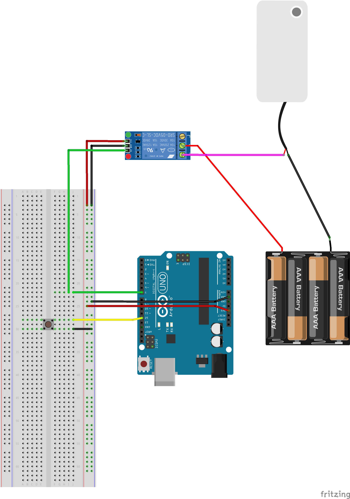

# 릴레이 및 펌프 모듈 제어 POC 프로젝트

## 소개
이 프로젝트는 Arduino를 사용하여 버튼 입력으로 릴레이를 제어하고, 이를 통해 펌프 모듈을 활성화 및 비활성화하는 Proof of Concept(POC) 구현입니다. 릴레이 모듈은 Active LOW 방식의 JQC3F-05VDC-C를 사용하며, 버튼을 누르면 릴레이가 3초 동안 활성화됩니다.

## 주요 기능
- **버튼 입력 감지**: 버튼(PULL-UP 방식)을 사용해 동작을 제어.
- **릴레이 제어**: 버튼 입력을 통해 릴레이를 활성화.
- **펌프 제어**: 릴레이를 통해 펌프 모듈의 전원을 간접적으로 제어.

## 회로 결선 방법

아래는 프로젝트 회로 연결 방법에 대한 설명입니다. 결선도는 `circuit.png`에서 확인할 수 있습니다.

### 주요 결선
1. **버튼**
   - 버튼 한쪽 핀을 Arduino의 **D12** 핀에 연결.
   - 다른 한쪽 핀을 GND에 연결.
   - 버튼의 상태는 `INPUT_PULLUP` 모드로 읽음.

2. **릴레이 모듈**
   - 릴레이 모듈의 **IN 핀** → Arduino의 **D7** 핀.
   - 릴레이 모듈의 **GND 핀** → Arduino의 GND 핀.
   - 릴레이 모듈의 **VCC 핀** → Arduino의 5V 핀.

3. **펌프**
   - 펌프의 + 단자 → 릴레이 모듈의 **NO (Normally Open)** 단자.
   - 펌프의 - 단자 → 배터리의 - 단자.
   - 배터리의 + 단자 → 릴레이 모듈의 **COM (Common)** 단자.

## 실행 방법
1. Arduino와 회로를 위 결선도에 따라 연결합니다.
2. PlatformIO 또는 Arduino IDE를 사용하여 코드를 업로드합니다.
3. 버튼을 누르면 릴레이가 활성화되고, 이를 통해 펌프가 3초 동안 작동합니다.

## 실제 진행
버튼 누를 경우 3초간 물 공급 진행 
https://github.com/slicequeue/poc-uno-control-water-pump-with-relay-btn/blob/main/circuit_real.mp4
<video controls src="circuit_real.mp4" title="실제 기능 테스트 진행"></video>

## 테스트 환경
- **보드**: Arduino Uno
- **릴레이 모듈**: JQC3F-05VDC-C (Active LOW)
- **펌프 모듈**: DC 펌프 (릴레이를 통해 전원 공급)
- **전원 공급**: AAA 배터리 팩 (펌프 구동용)

## 배운점 
1. 버튼 아두이노 우노에서 쉽게 풀업 세팅으로 다루는 법을 배움
2. 릴레이 다루는 법을 배웠고 활성화가 LOW 일 수 있다는 것을 배움
3. 처리 후 딜레이 1 적용하여 풀업 버튼 인식이 잘 될 수 있도록 디바운스 처리에 대해서 배움

